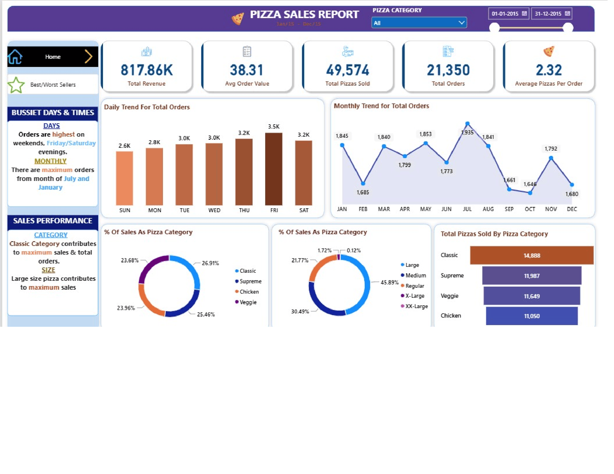

# 🍕 Pizza Sales Analysis Dashboard

An interactive **Power BI Business Intelligence Dashboard** designed to analyze pizza sales performance, customer ordering patterns, product performance, and revenue trends.

The project transforms raw pizza sales data into an interactive dashboard that helps identify **top-performing products, sales trends, customer preferences, and key business KPIs**.


---

## 📊 Dashboard Preview

### Executive Dashboard


> *Interactive Power BI dashboard showing key sales KPIs, trends, and product-level analysis.*

---

## 🎯 Project Objective

The objective of this project is to analyze pizza sales data and convert it into meaningful business insights using **Microsoft Power BI**.

The dashboard helps answer questions such as:

- How much revenue is being generated?
- How many orders and pizzas are being sold?
- Which pizzas are the most popular?
- Which pizza categories contribute the most to sales?
- What are the busiest days and months?
- Which pizza sizes are preferred by customers?
- Which products generate the highest revenue?
- How do sales change over time?

---

## 🛠️ Technologies Used

- **Microsoft Power BI** – Dashboard development and visualization
- **Power Query** – Data transformation and cleaning
- **DAX** – Calculated measures and KPIs
- **Microsoft Excel / CSV** – Data source

---

## 📁 Project Structure

```text
PIZZA-SALES-ANALYSIS-DASHBOARD/
│
├── 📊 Pizza_Sales_Analysis.pbix
│
├── 📂 Dataset/
│   └── pizza_sales.csv
│
├── 📂 Screenshots/
│   ├── dashboard.png
│   ├── sales_analysis.png
│   └── product_analysis.png
│
└── README.md
```

> File names can be changed according to the actual files in this repository.

---

## 📈 Key KPIs

The dashboard provides an overview of important sales metrics, including:

| KPI | Description |
|---|---|
| 💰 Total Revenue | Total revenue generated from pizza sales |
| 🧾 Total Orders | Total number of orders |
| 🍕 Total Pizzas Sold | Total number of pizzas sold |
| 💵 Average Order Value | Average revenue generated per order |
| 🍕 Average Pizzas per Order | Average number of pizzas purchased per order |

---

## 📊 Dashboard Analysis

### 1. Sales Overview

The dashboard provides an overall view of pizza sales performance through:

- Total revenue
- Total orders
- Total pizzas sold
- Average order value
- Average pizzas per order
- Daily and monthly sales trends

This provides a quick understanding of the overall business performance.

---

### 2. Sales Trend Analysis

Time-based analysis is used to understand how sales change throughout the year.

The dashboard analyzes:

- Daily order trends
- Monthly revenue trends
- Peak sales periods
- Low-performing periods
- Weekday vs. weekend ordering patterns

This can help businesses understand customer ordering behavior and plan inventory and promotions accordingly.

---

### 3. Pizza Category Analysis

Pizza sales are analyzed across different categories to identify which categories contribute most to overall sales.

The analysis helps identify:

- Best-performing categories
- Revenue contribution by category
- Order distribution across categories
- Customer preferences

---

### 4. Pizza Size Analysis

The dashboard analyzes customer preferences based on pizza size.

This includes:

- Sales by pizza size
- Orders by pizza size
- Revenue contribution
- Most preferred size

Understanding size preferences can help businesses optimize inventory and product offerings.

---

### 5. Product Performance Analysis

Individual pizza products are analyzed to identify:

- Top-selling pizzas
- Lowest-selling pizzas
- Highest-revenue products
- Product-level sales trends

This allows the business to identify products that perform particularly well and products that may require further attention.

---

## 📐 Data Analysis & DAX

The dashboard uses calculated measures to generate meaningful business KPIs.

Examples include:

```DAX
Total Revenue =
SUM(pizza_sales[total_price])
```

```DAX
Total Orders =
DISTINCTCOUNT(pizza_sales[order_id])
```

```DAX
Total Pizzas Sold =
SUM(pizza_sales[quantity])
```

```DAX
Average Order Value =
DIVIDE([Total Revenue], [Total Orders])
```

> DAX formulas above should be adjusted if the column/table names in the actual `.pbix` file are different.

---

## 🔄 Data Preparation

The dataset was prepared using **Power Query** before creating the dashboard.

The data preparation process included:

1. Importing the raw dataset
2. Reviewing data types
3. Cleaning and transforming relevant columns
4. Handling inconsistencies
5. Creating required fields
6. Loading the prepared data into Power BI
7. Creating relationships/measures where required

---

## 💡 Key Business Insights

The analysis can help identify:

- Which pizza products generate the highest sales
- Which categories are most popular
- Which pizza sizes customers prefer
- Which days have the highest order volume
- Which months show stronger sales performance
- Which products contribute significantly to revenue
- Patterns in customer ordering behavior

These insights can support decisions related to **inventory planning, promotions, product strategy, and sales optimization**.

---

## 📸 Dashboard Screenshots

### Main Dashboard 1.

)

### Main Dashbaord 2,



### Product Analysis

)

---

## 🚀 How to Use

### Option 1 — View the Dashboard

Open the published Power BI dashboard link provided in this repository, if available.

### Option 2 — Open the `.pbix` File

1. Download the `.pbix` file from this repository.
2. Install **Microsoft Power BI Desktop**.
3. Open the `.pbix` file.
4. Interact with the dashboard using the available filters and slicers.

---

## 🎓 Skills Demonstrated

This project demonstrates practical experience with:

- Business Intelligence
- Data Visualization
- Microsoft Power BI
- DAX
- Power Query
- Data Cleaning
- KPI Development
- Exploratory Data Analysis
- Business Analysis
- Dashboard Design
- Data-driven Decision Making

---

## 🔮 Future Improvements

Potential improvements to the project include:

- Adding a real-time sales data pipeline
- Connecting the dashboard directly to a SQL database
- Adding customer segmentation
- Implementing sales forecasting
- Adding advanced DAX calculations
- Creating automated refresh functionality
- Publishing an interactive Power BI Service dashboard

---

## 👨‍💻 Author

**Piyush Garg**

Computer Engineering Student

### Connect

- GitHub: [PiyushGarg5172](https://github.com/PiyushGarg5172)

---

## ⭐ Project

If you found this project useful or interesting, consider giving the repository a ⭐.
